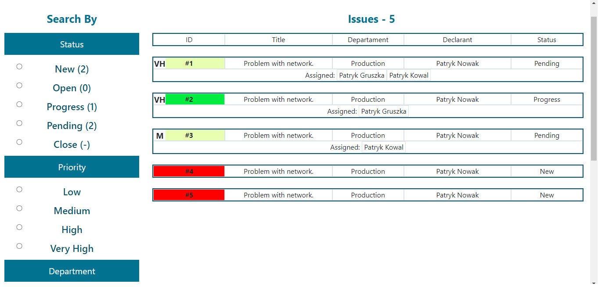
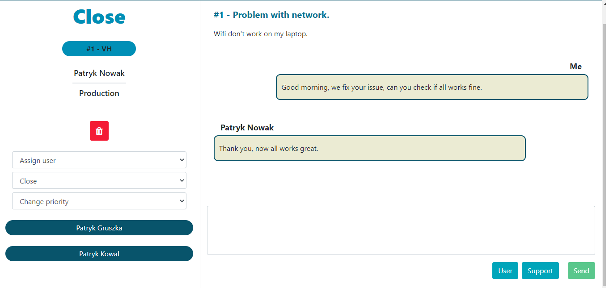

# TicketManagement

## Table of contents

- [General info](#general-info)
- [Screenshots](#screenshots)
- [Technologies](#technologies)
- [Setup](#setup)

## General info

TicketManagement - system to report issues.

## Screenshots

  

  

## Technologies

- ASP.NET Core API.
- Angular.
- SQL Server.

## Setup

Requirements:
* SQL Server Management Studio
* Microsoft SQL Server
* Node.js
* Angular CLI

To run API open TicketManagement.API.sln with Visual Studio, change from IIS Express to Warehouse.API and press F5.

To run SPA open TicketManagement folder in command-line or Visual Studio Code and 
`cd TicketManagement-SPA` 
`npm install`
`ng serve`

Open http://localhost:4200

Passwords:

* Boss:
 boss/Boss123

* Admin:
 admin/Admin123

* User:
 user/User123
